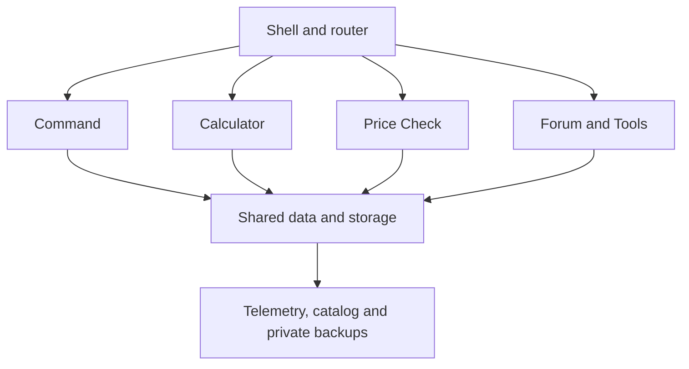

# RHW runtime and interface ownership

RHW is a dependency-free static application, not a framework rewrite.
The editable files are grouped by responsibility; generated bundles stay small in
request count. Edit an owner, not a new chronological fix/PR layer.

## Source ownership

| Location | Owns |
| --- | --- |
| `js/core/` | App shell, router, named lifecycle, primary/Tools navigation, refresh scheduling, boot and PWA |
| `js/command/` | Inventory, Shipyard, Production, Logistics and their navigation/status surfaces |
| `js/calculator/` | Catalog normalization, pure planning/costing, UI, labels, price profiles and Production bridge |
| `js/price-check/` | Fixed-route pricing, provenance, overrides and refresh lifecycle |
| `js/forum/` | Composer, BBCode, preview formatting and mobile views |
| `js/data/` | Telemetry, storage, backup import/export and legacy archive compatibility |
| `js/tools/` | Discovery status, diagnostics, audit and private device transfer |
| `js/shared/` | Utilities, accessibility and shared workspace controls |

`scripts/runtime-assets.json` is the ordered source manifest. Classic lexical
scope is preserved in the dashboard bundle. Workspaces register before
`js/core/boot.js` starts the app.

## Public routes and compatibility

`scripts/app-routes.json` is the single public-route contract. The first node of
each workspace is its default. It generates `js/core/routes.js`, supplies the
browser smoke matrix and is validated against all PWA shortcuts.

Nine destinations are published: four Command areas, Calculator, Price Check,
Forum, Drafts and Senders. Overview is an internal status sensor, not a route.
Legacy Overview, Orders and Newswire URLs redirect to Inventory, Calculator and
Forum. Retired editors are absent from the runtime and repository; Git history
retains them. `js/data/legacy-archive.js` and the storage import/export contract
retain old backup data without recreating removed features.

## Named lifecycle, not method overrides

`app.lifecycle.on(phase, name, order, callback)` registers a synchronous hook;
the returned function unsubscribes it. Owners emit after completing their work.
Async owners await their work before emitting. Hook names are unique per phase,
numeric order is explicit, and thrown failures reach the boot failure surface.
`app.lifecycle.describe()` exposes the ordered registrations for inspection.

| Owner phase | Extension order |
| --- | --- |
| `shell:ready` | Workspace labels → primary navigation → Price Check |
| `command:ready` | Status navigation → shared controls → surfaces → Logistics views → Inventory toolbar |
| `command:before-activate` / `command:activated` | Scroll preparation, then status/control updates with previous and current node |
| `catalog:loaded` | Discovery semantics → recipe labels |
| `calculator:before-init` / `calculator:ready` | Session reset, then Production bridge → costing display → profiles → navigation → labels |
| `forum:ready` / `forum:activated` | Mobile views → workspace navigation |
| `discovery:ready` | Data-status tool placement |

Modules must not replace another module's `init`, `activate`, `installShell`,
`loadCatalog` or `buildPlan`. The validator rejects that pattern. Recipe planning
selects affiliation outputs without temporarily mutating shared catalog data.
Session-only material prices are enforced at the single storage write boundary;
named price profiles remain persistent.

## Rendering and background work

`js/core/refresh.js` owns scoped `onRender(view, callback)` notifications and
`createRefreshTask`. Render hooks run after the owning renderer and must not
recursively call that renderer. `app.onUiUpdate` coalesces shared status changes.
Focused inputs and expanded seller cards survive refreshes.

A refresh task has one due time and one in-flight promise. Hidden/offline pages
do not schedule network work. Returning performs one overdue refresh, without
replaying missed intervals. Price Check refreshes only in its visible workspace.
PWA update checks run hourly while visible/online; activation still waits for
UPDATE NOW. Discovery workflow status is requested only through CHECK LATEST RUN.

## CSS ownership

The nine ordered stages preserve the established cascade and appearance:

| File | Responsibility |
| --- | --- |
| `css/tokens.css` | Shared literal palette |
| `css/foundation.css` | Local fonts, dashboard structure and base components |
| `css/workspaces.css` | Shell, navigation, Forum and Calculator foundations |
| `css/responsive.css` | Mobile/accessible controls and workspace adaptations |
| `css/tools.css` | PWA, Discovery, diagnostics, transfer and audit surfaces |
| `css/components.css` | Shared controls and component variants |
| `css/theme.css` | Current industrial theme and typography |
| `css/layout.css` | HUD, cards, grids and responsive geometry |
| `css/recipes.css` | Shared-price recipe comparison |

Keep changes in the owning stage. Do not append another release-wide override
file or inject CSS from JavaScript. Specificity and intentional `!important`
rules were retained to avoid visual regressions; consolidation is not a redesign.

## Build and deployment

Run `python3 scripts/build_app_assets.py` after edits. It generates bundles,
routes, metrics, the offline shell, HTML asset queries and build metadata. The
release revision is a SHA-256 digest of every deployed input, including icons,
fonts, catalog, bootstrap, manifest, HTML and worker logic. Rebuilding unchanged
sources is byte-identical. A content change also changes the service-worker file
itself; no manual version bump is required.

CI uses `--check` to reject stale output. `--check --dist` packages only 31
runtime/license files. Pages publishes `dist/`, never source modules, tests,
docs or local artifacts. Discovery proposals rebuild/stage the generated bundles
and revision before review; automation never merges its own catalog changes.

The Forum preview logo is local and cached. Exported BBCode uses the public
absolute PNG URL, so posts remain portable outside RHW. Installation icons use
standard 8-bit PNG channels; the optimizer verifies decoded target samples.
Crest and Forum artwork retain their original samples.

## Verification

- `python3 scripts/validate_dashboard.py`: shipped files, routes, manifest and build.
- `python3 scripts/test_build_assets.py`: revision sensitivity, idempotence and dist.
- `node scripts/test_app_contracts.js`: real router, defaults, storage policy and hooks.
- `node scripts/test_runtime_lifecycle.js`: background scheduling and render hooks.
- Other `test_*.js` / `test_discovery_sync.py`: catalog, quotes, provenance and backups.
- `python3 scripts/smoke_v40.py`: all nine public routes and workflows.
- `RHW_SMOKE_SITE=dist python3 scripts/smoke_interface_foundation.py`: actual deployed
  bundles at nine widths (360–1920 px), focus, local fonts and offline reload,
  including the Forum logo. Additional focused smoke tests cover Logistics,
  compact Command, primary navigation and recipe semantics.

Browser checks use controlled game-data fixtures, not a live-API availability
guarantee. Screenshots and detailed results are published as CI artifacts.
